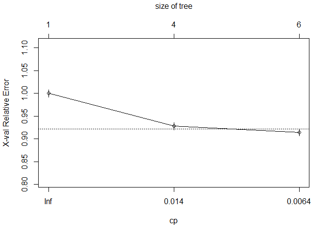

    library(regions)
    library(lubridate)
    library(dplyr)

    if ( dir.exists('data-raw') ) {
      data_raw_dir <- "data-raw"
    } else {
      data_raw_dir <- file.path("..", "..", "data-raw")
      }

The first results of our longitudinal table [were difficult to
map](post/2021-03-05-retroharmonize-climate/), because the surveys used
an obsolete regional coding. We will adjust the wrong coding, when
possible, and join the data with the European Environment Agency’s (EEA)
Air Quality e-Reporting (AQ e-Reporting) data on environmental
pollution. We recoded the annual level for every available reporting
stations \[*not shown here*\] and all values are in μg/m3. The period
under observation is 2014-2016. Data file:
<https://www.eea.europa.eu/data-and-maps/data/aqereporting-8> (European
Environment Agency 2021).

## Recoding the Regions

Recoding means that the boundaries are unchanged, but the country
changed the names and codes of regions because there were other boundary
changes which did not affect our observation unit. We explain the
problem and the solution in greater detail in [our
tutorial](http://netzero.dataobservatory.eu/post/2021-03-06-regions-climate/)
that aggregates the data on regional levels.

    panel <- readRDS((file.path(data_raw_dir, "climate-panel.rds")))

    climate_data_geocode <-  panel %>%
      mutate ( year:  lubridate::year(date_of_interview)) %>%
      recode_nuts()

Let’s join the air pollution data and join it by corrected geocodes:

    load(file.path("data", "air_pollutants.rda")) ## good practice to use system-independent file.path

    climate_awareness_air <- climate_data_geocode %>%
      rename ( region_nuts_codes :  .data$code_2016) %>%
      left_join ( air_pollutants, by:  "region_nuts_codes" ) %>%
      select ( -all_of(c("w1", "wex", "date_of_interview", 
                         "typology", "typology_change", "geo", "region"))) %>%
      mutate (
        # remove special labels and create NA_numeric_ 
        age_education:  retroharmonize::as_numeric(age_education)) %>%
      mutate_if ( is.character, as.factor) %>%
      mutate ( 
        # we only have responses from 4 years, and this should be treated as a categorical variable
        year:  as.factor(year) 
        ) %>%
      filter ( complete.cases(.) ) 

The `climate_awareness_air` data frame contains the answers of 75086
individual respondents. 17.07% thought that climate change was the most
serious world problem and 33.6% mentioned climate change as one of the
three most important global problems.

    summary ( climate_awareness_air  )

    ##                  rowid       serious_world_problems_first
    ##  ZA5877_v2-0-0_1    :    1   Min.   :0.0000              
    ##  ZA5877_v2-0-0_10   :    1   1st Qu.:0.0000              
    ##  ZA5877_v2-0-0_100  :    1   Median :0.0000              
    ##  ZA5877_v2-0-0_1000 :    1   Mean   :0.1707              
    ##  ZA5877_v2-0-0_10000:    1   3rd Qu.:0.0000              
    ##  ZA5877_v2-0-0_10001:    1   Max.   :1.0000              
    ##  (Other)            :75080                               
    ##  serious_world_problems_climate_change    isocntry    
    ##  Min.   :0.000                         BE     : 3028  
    ##  1st Qu.:0.000                         CZ     : 3023  
    ##  Median :0.000                         NL     : 3019  
    ##  Mean   :0.336                         SK     : 3000  
    ##  3rd Qu.:1.000                         SE     : 2980  
    ##  Max.   :1.000                         DE-W   : 2978  
    ##                                        (Other):57058  
    ##                                    marital_status         age_education  
    ##  (Re-)Married: without children           :13242   18            :15485  
    ##  (Re-)Married: children this marriage     :12696   19            : 7728  
    ##  Single: without children                 : 7650   16            : 5840  
    ##  (Re-)Married: w children of this marriage: 6520   still studying: 5098  
    ##  (Re-)Married: living without children    : 6225   17            : 5092  
    ##  Single: living without children          : 4102   15            : 4528  
    ##  (Other)                                  :24651   (Other)       :31315  
    ##    age_exact                      occupation_of_respondent
    ##  Min.   :15.0   Retired, unable to work       :22911      
    ##  1st Qu.:36.0   Skilled manual worker         : 6774      
    ##  Median :51.0   Employed position, at desk    : 6716      
    ##  Mean   :50.1   Employed position, service job: 5624      
    ##  3rd Qu.:65.0   Middle management, etc.       : 5252      
    ##  Max.   :99.0   Student                       : 5098      
    ##                 (Other)                       :22711      
    ##             occupation_of_respondent_recoded
    ##  Employed (10-18 in d15a)   :32763          
    ##  Not working (1-4 in d15a)  :37125          
    ##  Self-employed (5-9 in d15a): 5198          
    ##                                             
    ##                                             
    ##                                             
    ##                                             
    ##                        respondent_occupation_scale_c_14
    ##  Retired (4 in d15a)                   :22911          
    ##  Manual workers (15 to 18 in d15a)     :15269          
    ##  Other white collars (13 or 14 in d15a): 9203          
    ##  Managers (10 to 12 in d15a)           : 8291          
    ##  Self-employed (5 to 9 in d15a)        : 5198          
    ##  Students (2 in d15a)                  : 5098          
    ##  (Other)                               : 9116          
    ##                   type_of_community   is_student      no_education     
    ##  DK                        :   34   Min.   :0.0000   Min.   :0.000000  
    ##  Large town                :20939   1st Qu.:0.0000   1st Qu.:0.000000  
    ##  Rural area or village     :24686   Median :0.0000   Median :0.000000  
    ##  Small or middle sized town: 9850   Mean   :0.0679   Mean   :0.008151  
    ##  Small/middle town         :19577   3rd Qu.:0.0000   3rd Qu.:0.000000  
    ##                                     Max.   :1.0000   Max.   :1.000000  
    ##                                                                        
    ##    education       year       region_nuts_codes  country_code  
    ##  Min.   :14.00   2013:25103   LU     : 1432     DE     : 4531  
    ##  1st Qu.:17.00   2015:    0   MT     : 1398     GB     : 3538  
    ##  Median :18.00   2017:25053   CY     : 1192     BE     : 3028  
    ##  Mean   :19.61   2019:24930   SK02   : 1053     CZ     : 3023  
    ##  3rd Qu.:22.00                EL30   :  974     NL     : 3019  
    ##  Max.   :30.00                EE     :  973     SK     : 3000  
    ##                               (Other):68064     (Other):54947  
    ##      pm2_5             pm10               o3              BaP        
    ##  Min.   : 2.109   Min.   :  5.883   Min.   : 66.37   Min.   :0.0102  
    ##  1st Qu.: 9.374   1st Qu.: 28.326   1st Qu.: 90.89   1st Qu.:0.1779  
    ##  Median :11.866   Median : 33.673   Median :102.81   Median :0.4105  
    ##  Mean   :12.954   Mean   : 38.637   Mean   :101.49   Mean   :0.8759  
    ##  3rd Qu.:15.890   3rd Qu.: 49.488   3rd Qu.:110.73   3rd Qu.:1.0692  
    ##  Max.   :41.293   Max.   :123.239   Max.   :141.04   Max.   :7.8050  
    ##                                                                      
    ##       so2              ap_pc1            ap_pc2             ap_pc3       
    ##  Min.   : 0.0000   Min.   :-4.6669   Min.   :-2.21851   Min.   :-2.1007  
    ##  1st Qu.: 0.0000   1st Qu.:-0.4624   1st Qu.:-0.49130   1st Qu.:-0.5695  
    ##  Median : 0.0000   Median : 0.4263   Median : 0.02902   Median :-0.1113  
    ##  Mean   : 0.1032   Mean   : 0.1031   Mean   : 0.04166   Mean   :-0.1746  
    ##  3rd Qu.: 0.0000   3rd Qu.: 0.9748   3rd Qu.: 0.57416   3rd Qu.: 0.3309  
    ##  Max.   :42.5325   Max.   : 2.0344   Max.   : 3.25841   Max.   : 4.1615  
    ##                                                                          
    ##      ap_pc4            ap_pc5        
    ##  Min.   :-1.7387   Min.   :-2.75079  
    ##  1st Qu.:-0.1669   1st Qu.:-0.18748  
    ##  Median : 0.0371   Median : 0.01811  
    ##  Mean   : 0.1154   Mean   : 0.06797  
    ##  3rd Qu.: 0.3050   3rd Qu.: 0.34937  
    ##  Max.   : 3.2476   Max.   : 1.42816  
    ## 

Let’s see a simple CART tree! We remove the regional codes, because
there are very serious differences among regional climate awareness.
These differences, together with education level, and the year we are
talking about, are the most important predictors of thinking about
climate change as the most important global problem in Europe.

    # Classification Tree with rpart
    library(rpart)

    # grow tree
    fit <- rpart(as.factor(serious_world_problems_first) ~ .,
       method="class", data=climate_awareness_air %>%
         select ( - all_of(c("rowid", "region_nuts_codes"))), 
       control:  rpart.control(cp:  0.005))

    printcp(fit) # display the results

    ## 
    ## Classification tree:
    ## rpart(formula:  as.factor(serious_world_problems_first) ~ ., 
    ##     data:  climate_awareness_air %>% select(-all_of(c("rowid", 
    ##         "region_nuts_codes"))), method:  "class", control:  rpart.control(cp:  0.005))
    ## 
    ## Variables actually used in tree construction:
    ## [1] age_education                         isocntry                             
    ## [3] serious_world_problems_climate_change year                                 
    ## 
    ## Root node error: 12817/75086:  0.1707
    ## 
    ## n= 75086 
    ## 
    ##          CP nsplit rel error  xerror      xstd
    ## 1 0.0240566      0   1.00000 1.00000 0.0080438
    ## 2 0.0082703      3   0.92783 0.92783 0.0078055
    ## 3 0.0050000      5   0.91129 0.91425 0.0077588

    plotcp(fit) # visualize cross-validation results

    summary(fit) # detailed summary of splits

    ## Call:
    ## rpart(formula:  as.factor(serious_world_problems_first) ~ ., 
    ##     data:  climate_awareness_air %>% select(-all_of(c("rowid", 
    ##         "region_nuts_codes"))), method:  "class", control:  rpart.control(cp:  0.005))
    ##   n= 75086 
    ## 
    ##            CP nsplit rel error    xerror        xstd
    ## 1 0.024056592      0 1.0000000 1.0000000 0.008043837
    ## 2 0.008270266      3 0.9278302 0.9278302 0.007805478
    ## 3 0.005000000      5 0.9112897 0.9142545 0.007758824
    ## 
    ## Variable importance
    ## serious_world_problems_climate_change                              isocntry 
    ##                                    31                                    26 
    ##                          country_code                                   BaP 
    ##                                    20                                     8 
    ##                                 pm2_5                                ap_pc1 
    ##                                     4                                     3 
    ##                         age_education                                  pm10 
    ##                                     2                                     2 
    ##                             education                                ap_pc2 
    ##                                     2                                     1 
    ##                                  year 
    ##                                     1 
    ## 
    ## Node number 1: 75086 observations,    complexity param=0.02405659
    ##   predicted class=0  expected loss=0.1706976  P(node): 1
    ##     class counts: 62269 12817
    ##    probabilities: 0.829 0.171 
    ##   left son=2 (25229 obs) right son=3 (49857 obs)
    ##   Primary splits:
    ##       serious_world_problems_climate_change < 0.5          to the right, improve=2214.2040, (0 missing)
    ##       isocntry                              splits as  RRLLLRRRLLRLRLLLLLLLLLLRRLLLRLL, improve= 728.0160, (0 missing)
    ##       country_code                          splits as  RRLLLRRLLRLLLLLLLLLLRRLLLRLL, improve= 673.3656, (0 missing)
    ##       BaP                                   < 0.4300347    to the right, improve= 310.6229, (0 missing)
    ##       pm2_5                                 < 13.38264     to the right, improve= 296.4013, (0 missing)
    ##   Surrogate splits:
    ##       age_education splits as  ----RRRRRR-RRRRRRRRRR-RRRRRRRRRR-RRRRRRRRRR-RRRRRRRRRR-RRRRRL-RRR-RRRRRRRRR--RRRLLR--R-R, agree=0.664, adj=0, (0 split)
    ##       pm10          < 7.491315     to the left,  agree=0.664, adj=0, (0 split)
    ## 
    ## Node number 2: 25229 observations
    ##   predicted class=0  expected loss=0  P(node): 0.3360014
    ##     class counts: 25229     0
    ##    probabilities: 1.000 0.000 
    ## 
    ## Node number 3: 49857 observations,    complexity param=0.02405659
    ##   predicted class=0  expected loss=0.2570752  P(node): 0.6639986
    ##     class counts: 37040 12817
    ##    probabilities: 0.743 0.257 
    ##   left son=6 (34631 obs) right son=7 (15226 obs)
    ##   Primary splits:
    ##       isocntry     splits as  RRLLLRRRLLRLRLLLLLLLLLLRRLLLRLL, improve=1454.9460, (0 missing)
    ##       country_code splits as  RRLLLRRLLRLLLLLLLLLLRRLLLRLL, improve=1359.7210, (0 missing)
    ##       BaP          < 0.4300347    to the right, improve= 629.8844, (0 missing)
    ##       pm2_5        < 13.38264     to the right, improve= 555.7484, (0 missing)
    ##       ap_pc1       < -0.005459537 to the left,  improve= 533.3579, (0 missing)
    ##   Surrogate splits:
    ##       country_code splits as  RRLLLRRLLRLLLLLLLLLLRRLLLRLL, agree=0.987, adj=0.957, (0 split)
    ##       BaP          < 0.1749425    to the right, agree=0.775, adj=0.264, (0 split)
    ##       pm2_5        < 5.206993     to the right, agree=0.737, adj=0.140, (0 split)
    ##       ap_pc1       < 1.405527     to the left,  agree=0.733, adj=0.126, (0 split)
    ##       pm10         < 25.31211     to the right, agree=0.718, adj=0.076, (0 split)
    ## 
    ## Node number 6: 34631 observations
    ##   predicted class=0  expected loss=0.1769802  P(node): 0.4612178
    ##     class counts: 28502  6129
    ##    probabilities: 0.823 0.177 
    ## 
    ## Node number 7: 15226 observations,    complexity param=0.02405659
    ##   predicted class=0  expected loss=0.4392487  P(node): 0.2027808
    ##     class counts:  8538  6688
    ##    probabilities: 0.561 0.439 
    ##   left son=14 (11607 obs) right son=15 (3619 obs)
    ##   Primary splits:
    ##       isocntry      splits as  LL---LLR--L-L----------LL---R--, improve=337.5462, (0 missing)
    ##       country_code  splits as  LL---LR--L-L--------LL---R--, improve=337.5462, (0 missing)
    ##       age_education splits as  ----LLLLLL-LLLRRRRRRR-RRRRRRRRRL-RRRRRRLLRR-RRRRLLRLRL-RRLRRR-RRR-LLLLRRR-----LR-----L-R, improve=294.0807, (0 missing)
    ##       education     < 22.5         to the left,  improve=262.3747, (0 missing)
    ##       BaP           < 0.053328     to the right, improve=232.7043, (0 missing)
    ##   Surrogate splits:
    ##       BaP           < 0.053328     to the right, agree=0.878, adj=0.485, (0 split)
    ##       pm2_5         < 4.810361     to the right, agree=0.827, adj=0.271, (0 split)
    ##       ap_pc2        < 0.8746175    to the left,  agree=0.792, adj=0.124, (0 split)
    ##       so2           < 0.3302972    to the left,  agree=0.781, adj=0.078, (0 split)
    ##       age_education splits as  ----LLLLLL-LLLLLLLRLR-LRRLRRRRRR-RRRRLLLLLR-LRLRLLRRLL-LLRLLR-LLR-RRLLLLL-----RR-----R-L, agree=0.779, adj=0.071, (0 split)
    ## 
    ## Node number 14: 11607 observations,    complexity param=0.008270266
    ##   predicted class=0  expected loss=0.3804601  P(node): 0.1545827
    ##     class counts:  7191  4416
    ##    probabilities: 0.620 0.380 
    ##   left son=28 (7462 obs) right son=29 (4145 obs)
    ##   Primary splits:
    ##       age_education                    splits as  ----LLLLLL-LRRRRRRRRR-RRLRRLRRLL-RRRRLRLLRR-RLRLLLRLRL-RR-RR--RRL-L-LLRRR------------L-R, improve=123.71070, (0 missing)
    ##       year                             splits as  R-LR, improve=107.79460, (0 missing)
    ##       education                        < 20.5         to the left,  improve= 90.28724, (0 missing)
    ##       occupation_of_respondent         splits as  LRRLRRRRRLRLLLRLLL, improve= 84.62865, (0 missing)
    ##       respondent_occupation_scale_c_14 splits as  LRLLLRRL, improve= 68.88653, (0 missing)
    ##   Surrogate splits:
    ##       education                        < 20.5         to the left,  agree=0.950, adj=0.861, (0 split)
    ##       occupation_of_respondent         splits as  LLLLRLLRRLRLLLRLLL, agree=0.738, adj=0.267, (0 split)
    ##       respondent_occupation_scale_c_14 splits as  LRLLLLRL, agree=0.733, adj=0.251, (0 split)
    ##       is_student                       < 0.5          to the left,  agree=0.709, adj=0.186, (0 split)
    ##       age_exact                        < 23.5         to the right, agree=0.676, adj=0.094, (0 split)
    ## 
    ## Node number 15: 3619 observations
    ##   predicted class=1  expected loss=0.3722023  P(node): 0.04819807
    ##     class counts:  1347  2272
    ##    probabilities: 0.372 0.628 
    ## 
    ## Node number 28: 7462 observations
    ##   predicted class=0  expected loss=0.326052  P(node): 0.09937938
    ##     class counts:  5029  2433
    ##    probabilities: 0.674 0.326 
    ## 
    ## Node number 29: 4145 observations,    complexity param=0.008270266
    ##   predicted class=0  expected loss=0.4784077  P(node): 0.05520337
    ##     class counts:  2162  1983
    ##    probabilities: 0.522 0.478 
    ##   left son=58 (2573 obs) right son=59 (1572 obs)
    ##   Primary splits:
    ##       year                     splits as  L-LR, improve=40.13885, (0 missing)
    ##       occupation_of_respondent splits as  LRLLRRRRRLRLLLRLLL, improve=18.33254, (0 missing)
    ##       marital_status           splits as  LRRRLRRRLRRLRLLRRRRRRLRLRLLRR, improve=17.86888, (0 missing)
    ##       type_of_community        splits as  LRLRL, improve=17.55254, (0 missing)
    ##       age_education            splits as  ------------LLRRRRRRR-RR-RL-RR---LRRR-R--LR-R-R---R-R--RR-RR--RR------RRR--------------R, improve=14.66121, (0 missing)
    ##   Surrogate splits:
    ##       type_of_community splits as  LLLRL, agree=0.777, adj=0.412, (0 split)
    ##       marital_status    splits as  RRLLLLLRLLLLLLLRRRLLLLLLRLRLL, agree=0.680, adj=0.155, (0 split)
    ##       isocntry          splits as  LL---LL---L-R----------LL------, agree=0.669, adj=0.127, (0 split)
    ##       country_code      splits as  LL---L---L-R--------LL------, agree=0.669, adj=0.127, (0 split)
    ##       o3                < 83.06345     to the right, agree=0.650, adj=0.076, (0 split)
    ## 
    ## Node number 58: 2573 observations
    ##   predicted class=0  expected loss=0.4240187  P(node): 0.03426737
    ##     class counts:  1482  1091
    ##    probabilities: 0.576 0.424 
    ## 
    ## Node number 59: 1572 observations
    ##   predicted class=1  expected loss=0.43257  P(node): 0.02093599
    ##     class counts:   680   892
    ##    probabilities: 0.433 0.567

    # plot tree
    plot(fit, uniform=TRUE,
       main="Classification Tree: Climate Change Is The Most Serious Threat")
    text(fit, use.n=TRUE, all=TRUE, cex=.8)

    ## Warning in labels.rpart(x, minlength:  minlength): more than 52 levels in a
    ## predicting factor, truncated for printout

    saveRDS ( climate_awareness_air , file.path(tempdir(), "climate_panel_recoded.rds"), version:  2)

    # not evaluated
    saveRDS( climate_awareness_air, file:  file.path("data-raw", "climate-panel_recoded.rds"))
