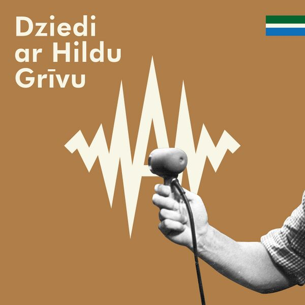

---
# Project title.
title: "Cultural Music Distribution Reimagined"
subtitle: "Making Marginalised Music Heard. Making Metadata Work."

# Date this page was created.
date: 2025-06-17T11:00:00
lastmod: 2025-06-17T15:16:00+01:00

# Project summary to display on homepage.
summary: "Unlabel is a groundbreaking initiative that transforms how culturally significant but commercially overlooked music reaches the world."

# Tags: can be used for filtering projects.
tags: 
 - Listen Local
 - Trustworthy AI
 - Music recommendations
 
# Optional external URL for project (replaces project detail page).
external_link: ""

# Slides (optional).
#   Otherwise, set `slides: ""`.
slides: ""

# Links (optional).
url_pdf: ""
url_slides: ""
url_video: ""
url_code: ""

# Custom links (optional).
#   Uncomment line below to enable. For multiple links, use the form `[{...}, {...}, {...}]`.
#url_custom: [{icon_pack: "fab", icon="twitter", name="Follow", url: "https://twitter.com/antaldaniel"}]

# Featured image
# To use, add an image named `featured.jpg/png` to your project's folder. 
image:
  caption: ""
  
  # Focal point (optional)
  # Options: Smart, Center, TopLeft, Top, TopRight, Left, Right, BottomLeft, Bottom, BottomRight
  focal_point: "Center"
---

Unlabel is a groundbreaking initiative that transforms how culturally significant but commercially overlooked music reaches the world. Our mission is clear: connect the fragmented landscape of music archives, rights holders, and platforms to make music in small or endangered languages discoverable, accessible, and respected.

## Why Unlabel?

Too often, music of high cultural value remains hidden---from archival recordings in museums to forgotten tapes in libraries---because the metadata required for distribution is inconsistent, incomplete, or incompatible with industry standards.

Unlabel solves this problem through collaborative metadata repair and seamless digital distribution, unlocking access for artists, researchers, educators, and audiences.

## What We Do

:white_check_mark: Repair & Enrich Metadata We connect public libraries, archives, rights organisations, and platforms to harmonise and validate music metadata collaboratively.

:white_check_mark: Bridge Archival & Digital Worlds Our API layer transforms archival data into DDEX-compatible formats, allowing direct publishing to platforms like Spotify, Apple Music, and YouTube.

:white_check_mark: Support Ethical & Legal Readiness We ensure proper rights clearance and ethical documentation---even for legacy or sensitive recordings---by aligning with GDPR, copyright law, and cultural values.

:white_check_mark: Tell Forgotten Stories We don't just distribute music. We contextualise it. Each release is accompanied by rich multilingual metadata on Wikidata, Wikipedia, MusicBrainz, and more.

## Featured Case Study: Hilda Griva

-   [x] Cleared complex rights

-   [x] Created multilingual metadata

-   [x] Published her biography and recordings

-   [x] Released her work globally

Her story is a powerful example of how cultural memory can be revived through careful, collaborative data work.

## Built on Open, Interoperable Data Spaces

Unlabel is part of the Open Music Observatory, aligning with European values of multilingualism, subsidiarity, and data sovereignty. We apply a layered interoperability model---legal, organisational, semantic, and technical---based on the 8-Star FAIR principles and the European Interoperability Framework.

Our tools and infrastructure make it possible to:

-   [x] Prepare metadata for reuse
-   [x] Validate cultural rights and provenance
-   [x] Federate content across Europe and beyond

## Join Us

Whether you're a music archive, cultural institution, rights manager, or researcher---Unlabel invites you to collaborate. Together, we can build a more inclusive musical memory, one record at a time.

:link: [Get in touch](mailto:test@unlabelmusic.net) 

:link: [Explore our pilot releases](https://reprexbase.eu/fu/Item:Q4743) + [Spotify](https://open.spotify.com/album/5sklbNUqv1Y5SlBXzr4McT) 

:link: [Learn about Open Music Europe](https://openmuse.eu)
