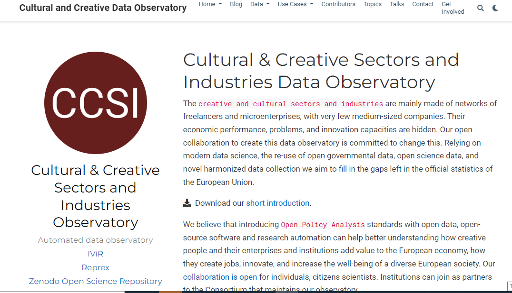
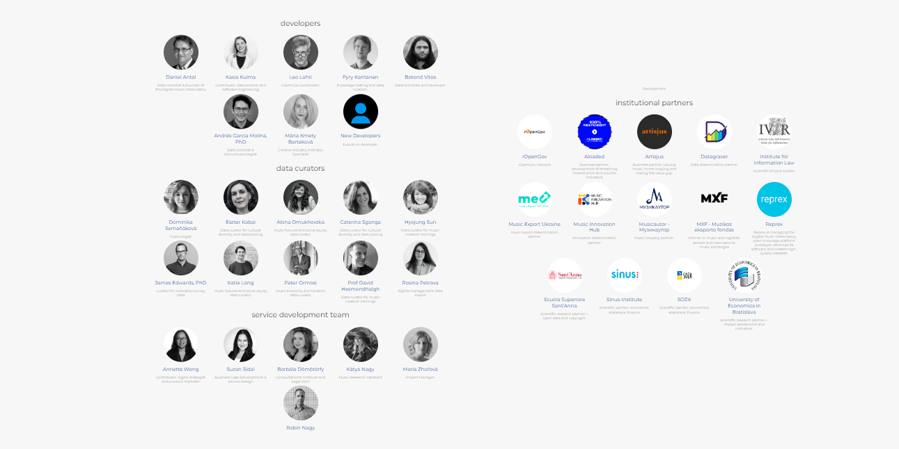

# Big Data Creates Inequalities

Only the largest corporations, best-endowed universities, and rich governments can afford data collection and processing capacities that are large enough to harness the advantages of AI.

---

## Slide navigation

Fullscreen: `F`
- Next: `>` or `Space` | Previous: `<`
- Start: `Home` | Finish: `End`
- Overview: `Esc`|  Speaker notes: `S`
- Zoom: `Alt + Click`

----

## Data problems

| 

  |   |
|---|:--|
| | 
The cost of questionnaire-based market research (survey) is increasing exponentially and offers mediocre results without an enormous question bank and harmonization with other surveys.(See [🖱 blogpost](https://reprex.nl/data/surveys/)) 
 |
| | 
Manual data acquisition is an error-prone and boring task for humans that requires many working hours (often not credited in consultancies, law firms, or research institutes.)
 |
| | 
Wrangling spreadsheet tables or word processor documents by people without data knowledge is the [🖱 data Sisyphus](https://reprex.nl/post/2021-07-08-data-sisyphus/).
 |

---

## Data observatories 3.0

Reprex is offering shared data ecosystems. Our observatories are great solutions for organizations without a data specialization:

| | 
|:--|
|
🌳 Organizations that cannot afford to build a large enough data team to sustain consistent, extensive data collection and processing (many large institutions and companies)
|
|
🪴  Who cannot hire even a single data engineer or a data scientist (medium-sized companies, NGOs)
|
|
🌱 Who do not even have a permanent IT function (about 2 million European small enterprises and civil society organizations)
|

---

| 

  |   |
|---|:--|
| | 
The European Union, the World Bank, OECD, and UN have facilitated the creation of more than 80 so-called 'data observatories' to help companies, researchers, NGOs, and governments systematically collect data and knowledge.
 |
| | 
We are currently building one prototype for the European Music Observatory financed by the European Union and music industry players (cc 3-4 million euros.)  We would like to take over existing or start new observatories in 2 years at least 5)
 |
| | 
Our observatories are competitive, because they use high-quality open source scientific software; they exploit the new Data Governance Act and Open Data Directive, deploy web 3.0 data synchronization, and offer great value-added research products.
 |

---

| Platform products|  Value added data applications |
|---|---|
|
The European Union, the World Bank, OECD, and UN have facilitated the creation of more than 80 so-called 'data observatories' to help companies, researchers, NGOs, and governments systematically collect data and knowledge.
| 
The different observatories offer different types of knowledge products, such as statistical yearbooks, various apps, and database access.
|
|
Most of them use web 1.0 technologies, inefficient knowledge accumulation.  Already 20 of them have been discontinued.| 
We are developing software solutions that exploit our platforms: we harmonize surveys, statistical data, automate research reporting, elements of market monitoring or ESG reporting.
|
|
 We are currently building one prototype for the European Music Observatory financed by the European Union and music industry players (cc 3-4 million euros.)  We would like to take over existing or start new observatories  in 2 years at least 5) 
| 
Each observatory gives us intimidate customer access to 3-4 large universities, 1-2 large consultancies, and various specialist institutions. 
|

---

## Marketing strategy

| 

  |   |
|---|:--|
| | 
Buma/Stemra like copyright management agencies, music export offices, festivals and venues,  University of Amsterdam, Sant’Anna, Economic University of Bratislava, ministries of culture, grant agencies.
 |
| | 
University of Amsterdam, Europeana, Sant’Anna, Hungarian Film Fund
 |
|| 
Connected financial and sustainability reporting: bank consultancies, big four audit companies, large environmental NGOs.
 |
|| 
Antitrust agencies, law firms, economics consultancies working with mergers and other competition related issues.
 |

---

## Target market size

|   |   |
|---|:--|
| 
The observatory platforms usually have a build-up cost of about 3-5 million euros and an annual running costs of 0.1-3 million  euros.
 |
 Some of our basic products are included in the platform service. 

|
 Our existing observatories give us access to the market and public surveying markets (cc 30-40 billion euros in the developed nations), particularly to  its software component (about 10 billion euros). 
|
|
[retroharmonize](https://retroharmonize.dataobservatory.eu/) integrates pre-existing questionnaire-based surveys and new surveys. It is aimed at large, international survey companies (Kantar, Gfk) and large international survey programs (Eurostat, GESIS).
regions improves the granularity of existing market research with ‘small area statistics’. 
 | 
| 
Our existing observatories gave us access to environmental impact assessment and currently we build an ESG reporting tool with a central bank, a value bank, and a big four company. 
| |
|
We hope to gain at least 10% global market share on the observatory platform management market to pay our basic data science team and R&D. 
| |
---

## Team

| 

  |   |
|---|:--|
|  |  
The two co-founders, [🖱 Daniel Antal, CFA](https://reprex.nl/authors/daniel_antal/) and [🖱 Andrés García Molina, PhD](https://reprex.nl/authors/andres/), and the core team manage the ecosystems' development, develop knowledge management, and direct the software development. [🖱 Team on full screen](https://reprex.nl/#team)
  |
|  | 
Each observatory has a broader team of users, data and knowledge curators, and developers. The most developed [🖱️ Digital Music Observatory](https://music.dataobservatory.eu/#contributors) has 16 institutional users and a team of about 20 music and data professionals. The newer observatories have a smaller, initial service development and data curatorial team.
  |

---

## Traction

We have a good, organic growth, but we mainly work with very large private and public entities with complicated, lengthy and not startup-friendly procurement with a cash-conversion cycle of up
---

## Funding

- We have a good track record in EU tenders, but we would like to build up this reputation in the Netherlands, too, mainly for new platforms.
- We help our non-profit users, such as cultural heritage organizations, music export offices, collective rights management agencies to get funding to use our platforms and services.  We have a track record in the EU, Slovakia, Lithuania, but not in the Netherlands.
- Our for profit-users need a more polished, user-friendlier front-end.  Some are interested in joint ventures (like exploiting our survey capabilities). Venture capital would be preferred, as demand outstrips growth.

---
<<<<<<< HEAD
<!---
=======
<<<<<<< HEAD

=======
<!---
>>>>>>> 3f54846 (slide navigation)
>>>>>>> 492e595ef6d7e32fb335eebe67954d0d4bbcd7b9
## Pool and take over work where humans fail 

- The cost of questionnaire-based market research (survey) is increasing exponentially and offers mediocre results without an enormous question bank and harmonization with other surveys.
- Manual data acquisition is an error-prone and boring task for humans that requires many working hours (often not credited in consultancies, law firms, or research institutes.)
- Wrangling spreadsheet tables or word processor documents by people without data knowledge is the data Sisyphus.

---

## Open source software and open platform

- Our survey harmonization tool offers hundreds of thousands of answers for your questionnaire item from dozens of countries and many years. We reduce the market research cost while exponentially increasing its value with data harmonization.
- We use automated statistical software or web 3.0 technology to synchronize data automatically with our client's database, dashboard, or spreadsheet.
- Our observatories automate repetitive processing tasks like re-formatting, currency translation, measurement units, documentation, bibliography, and hypertext link management with many computerized 'unit tests.'  We let the computer do the work where humans often make errors or remain hopelessly slow.
---

## Shared evidence ecosystems: data observatories

- Organizations that cannot afford to build a large enough data team to sustain consistent, extensive data collection and processing (many large institutions and companies)
- Who cannot hire even a single data engineer or a data scientist
- Who do not even have a permanent IT function (about 2 million European small enterprises and civil organizations)

---
--->



---

<!---

  
  
  

---

  
  
  

---

## What are data observatories?

- There are more than 60 functional, and about 20 already discontinued data observatories, i.e. long-term, usually triangular (business, academic, policy) data collection institutions recognized by the EU, OECD or UNESCO, including the [European Observatory on Infringements of Intellectual Property Rights](https://single-market-economy.ec.europa.eu/industry/strategy/intellectual-property/enforcement-intellectual-property-rights/european-observatory-infringements-intellectual-property-rights_en#:~:text=The%20European%20Observatory%20on%20Infringements,countries%2C%20businesses%20and%20civil%20society.) of the EU or the [European Audiovisual Observatory](https://www.obs.coe.int/en/web/observatoire) of the Council of Europe.

---
--->

## Do it Smarter

- They usually do not exchange standard data with statistical agencies, they are not synchronized on knowledge graphs of the Europeana or national libraries, and their research output is usually not to be found on open science repositories.
- The Hague is the winner of the [World Smart City Award 2021](https://thehague.com/businessagency/the-hague-the-winner-world-smart-city-award-2021), and we would like to attract the planned European Music Observatory and other, EU/UNESCO recognized institutions into the town building on the innovations of Reprex and the ecosystem of the Hague.

---

# Questions?

[Email](https://reprex.nl/#contact) | [Keybase](https://keybase.io/team/reprexcommunity) 

LinkedIn: [Daniel Antal](https://www.linkedin.com/in/antaldaniel/) - [Reprex](https://www.linkedin.com/company/68855596)

