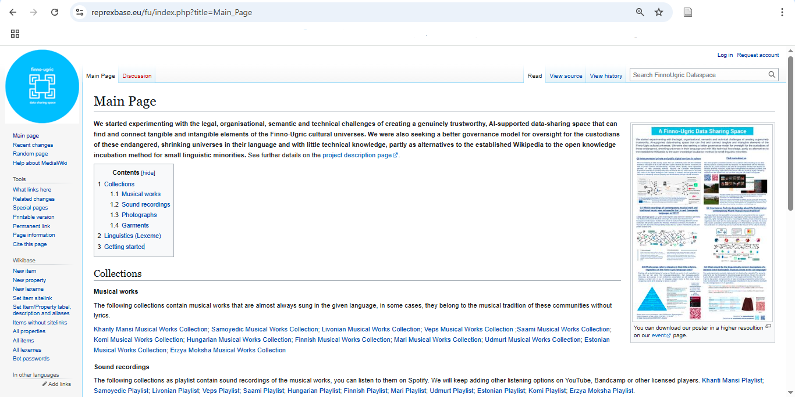
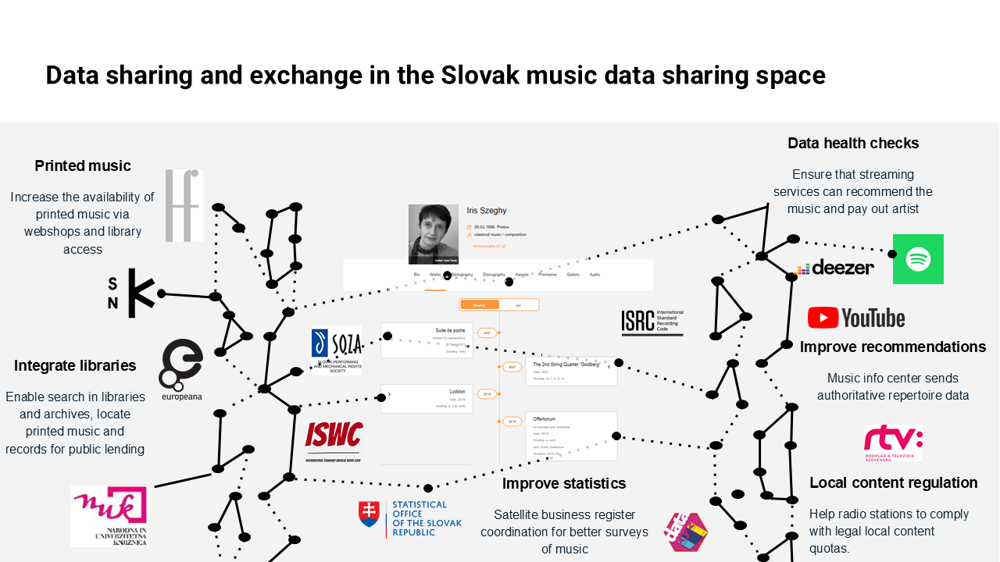
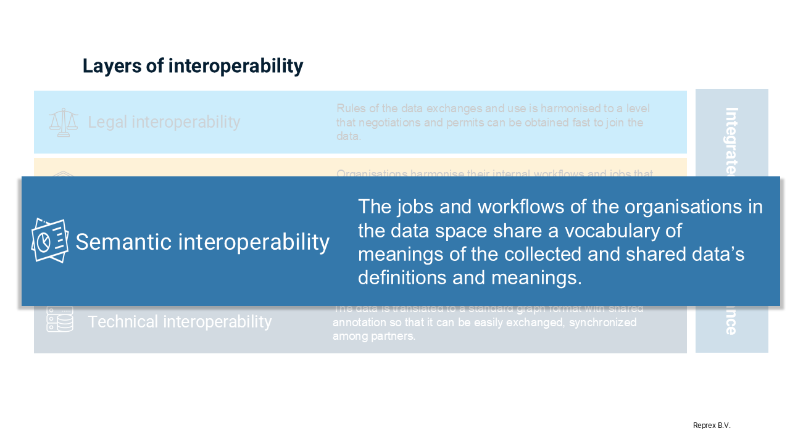
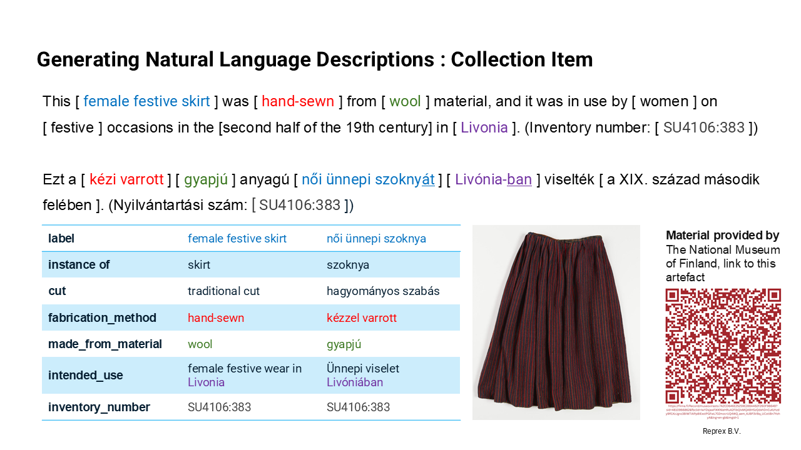
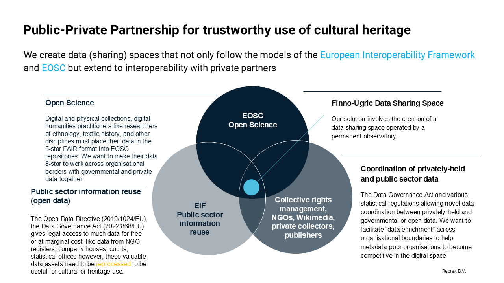

# The Finno-Ugric Data Sharing Space


- [Motivation and Background](#motivation-and-background)
- [Prototype for PPP Knowledge Incubation Into the Wikimedia
  Ecosystem](#prototype-for-ppp-knowledge-incubation-into-the-wikimedia-ecosystem)
  - [Competency Questions: All Layers of the European Interoperability
    Framework
    Applied](#competency-questions-all-layers-of-the-european-interoperability-framework-applied)
    - [Q1: Define the Scope of the Cultural
      Universe](#q1-define-the-scope-of-the-cultural-universe)
    - [Q2: Bridge Institutional and Linguistic
      Silos](#q2-bridge-institutional-and-linguistic-silos)
    - [Q3: Translate Information into Structured, Interoperable
      Knowledge](#q3-translate-information-into-structured-interoperable-knowledge)
    - [Q4: Translate Structured Knowledge into Human-Readable
      Language](#q4-translate-structured-knowledge-into-human-readable-language)
    - [Q5: Enable Legal and Technical Interoperability Across Public and
      Private Knowledge
      Sources](#q5-enable-legal-and-technical-interoperability-across-public-and-private-knowledge-sources)
  - [Competency Questions: Involving Wikipedians and the Wikimedia
    Ecosystem](#competency-questions-involving-wikipedians-and-the-wikimedia-ecosystem)
    - [Q6: Integrate Contemporary and Non-Traditional Cultural
      Expressions](#q6-integrate-contemporary-and-non-traditional-cultural-expressions)
    - [Q7: Use Computational Linguistics to Enrich Lexicographic
      Resources via Lexeme and Wiktionary
      Integration](#q7-use-computational-linguistics-to-enrich-lexicographic-resources-via-lexeme-and-wiktionary-integration)
    - [Q8: Create Interpretive Layers That Complement Wikipedia’s
      Notability
      Criteria](#q8-create-interpretive-layers-that-complement-wikipedias-notability-criteria)
- [Policy Alignment and Ethical
  Governance](#policy-alignment-and-ethical-governance)
  - [Making Interoperability
    Meaningful](#making-interoperability-meaningful)
  - [Making Governance Participatory](#making-governance-participatory)
  - [From Infrastructure to
    Oversight](#from-infrastructure-to-oversight)
- [References](#references)

 

# Motivation and Background

[](https://reprexbase.eu/fu/index.php?title=Main_Page)

The `Finno-Ugric Data Sharing Space` builds on a prior project that
unified all known music ever recorded or produced in Slovakia
(Ministerstvo kultúry SR and Open Music Europe 2023) together with a
Wikipedian-in-residence. Although Slovak music represents a relatively
compact cultural domain, the relevant information was scattered across
multiple public and private institutions, each with its own metadata
structures, languages, and access constraints. This earlier work
demonstrated that, even within a narrowly defined cultural area,
knowledge integration is complex and labor-intensive—but also highly
impactful when successful. By coordinating diverse stakeholders and
aligning their data practices, we created a shared knowledge
infrastructure that respected institutional contexts while enabling
broader discovery, reuse, and enrichment.



The `Finno-Ugric Data Sharing Space` extends this approach into an even
more fragile and urgent domain: endangered linguistic and cultural
communities. In this case, we are not simply aggregating and harmonizing
fragmented open knowledge. We are engaging with *disappearing cultural
universes*—contexts in which the languages themselves (such as Liv or
Mari) are severely endangered, and the number of fluent speakers or
cultural custodians may be in the dozens. Here, the risk is not only
that knowledge may be lost, but that it may never have been documented
in the first place, or only in languages and formats inaccessible to the
communities of origin.

This dual challenge—of endangered knowledge *and* endangered
language—demands a more comprehensive model. Our platform must support
not only *language-independent conceptualisation* (e.g., structured
metadata in RDF), but also the *revitalization of language-bound
representation* (e.g., cultural descriptions written *in* Liv or Seto).
The same object—a song, a garment, a photograph—must exist both as
structured data and as culturally grounded, linguistically accurate
narrative.

While our commitment to small Finno-Ugric communities is personal and
specific, we believe the model we propose is broadly applicable. Many
cultural and scholarly domains—such as interwar Slovak modernism or
regional Sámi ethnographies—are also characterized by a small number of
experts, a high dispersion of sources, and a lack of critical mass for
traditional, crowd-driven knowledge curation. These are what we call
*high-friction knowledge spaces*: areas where the cost of collecting,
interpreting, and validating information is disproportionately high
because of institutional, linguistic, or epistemic fragmentation.

The Finno-Ugric Data Sharing Space offers a blueprint for addressing
these challenges. It is designed as a **staging environment**,
compatible with Wikimedia’s platforms, where small communities can
collaboratively curate, translate, and validate their cultural
knowledge—on their own terms—before integrating it into the global
commons.


Our project idea started to develop on the Wikimedia CEE 2024 Meeting
when we discussed with Finnish, Estonian and Hungarian Wikipedians the
possibility to give a boost to participation of minorities from the
Finno-Ugric language group in Wikimedia projects. (Antal, Grochal, and
Varvantakis 2024)

While Wikipedia plays a central role in global knowledge sharing, it
also operates under general-purpose policies—such as notability
criteria—that can unintentionally exclude the perspectives, figures, and
artefacts of smaller communities. The narrower the cultural universe,
the more likely it is that meaningful individuals, events, or objects
will fall below these thresholds, despite their deep significance within
their own context.

To address this, our platform includes a curatorial layer—currently
called **WikiGLAM**—that allows the creation of *virtual exhibitions*
and *contextual collection pages*. These pages do not compete with
Wikipedia articles but instead complement them, providing a format where
cultural specificity and community storytelling can flourish, even when
individual items do not meet notability requirements. For instance, a
Wikipedia article might not accept a page for each Seto singer, but a
digital exhibit on “The Seto Singing Tradition” can present ten singers,
with biographical context, images, and audio recordings—all linked
through Wikidata and hosted via Wikimedia Commons. This curatorial model
rebalances the representation of cultural minorities without diluting
the editorial integrity of Wikipedia.


 

# Prototype for PPP Knowledge Incubation Into the Wikimedia Ecosystem

## Competency Questions: All Layers of the European Interoperability Framework Applied

To guide the design and implementation of the Finno-Ugric Data Sharing
Space, we define the following key competencies the platform must
address:

 

### Q1: Define the Scope of the Cultural Universe

The platform is not intended to replicate a general-purpose
encyclopedia. For communities like the Liv, with only a few hundred
remaining speakers, the informational needs center on the *preservation
of their specific cultural world*: geographic features bearing Liv
names, remaining Liv-speaking villages and buildings, garments, oral
traditions, folk songs, and the vocabulary needed to describe these in
the Liv language. Our system must support the creation and structuring
of a *domain-specific encyclopedic resource*, rooted in the cultural
priorities of the communities it serves.



The `Finno-Ugric Dataspace` should support domain-specific encyclopedic
content generation that reflects the *cultural worldview and linguistic
nuance* of the Livonian community, rather than defaulting to
general-purpose geographic knowledge as seen in standard Wikipedias.
This content becomes the foundation of a Livonian-language encyclopedic
resource—complementary to but distinct from global projects.

> [!NOTE]
>
> ### Q1: generate structured entries
>
> *Can the system generate structured entries and multilingual
> encyclopedic descriptions of culturally significant Livonian
> geographical locations, using the Livonian Place Name Catalogue as a
> source, and provide historical variants in Latvian, Russian, and
> German where available?*
>
> From the [Livonian Place Name
> Catalogue](https://www.livonian.lv/en/publications/the-livonian-place-name-catalogue/),
> the place *Irē (Livonian)* / *Mazirbe (Latvian)* is one of the most
> significant locations in Livonian cultural memory. The system should
> be able to:
>
> - Represent the Livonian name (*Irē*), along with Latvian (*Mazirbe*),
>   and historical Russian and German variants (*Мазирбе*,
>   *Maserwieken*).
>
> - Link the place to its role in Livonian history and cultural revival
>   (e.g., site of the Livonian House of the People).
>
> - Include geographical coordinates and administrative details.
>
> - Enable users to generate a short encyclopedia-style page or entry in
>   Livonian, describing Irē’s cultural and linguistic relevance.
>
> - Link to associated artefacts, songs, photos, or oral histories from
>   this location.

 

### Q2: Bridge Institutional and Linguistic Silos

Knowledge about stateless or minoritized communities—such as the Seto,
Mari, or Liv—is distributed across public and private collections in
countries with different national languages (Latvian, Estonian, Finnish,
Hungarian, Russian, German). These collections are managed under varied
knowledge organization models typical to GLAM institutions. Our platform
must support *cross-lingual and cross-institutional discovery*, enabling
users to locate and contextualize Seto or Liv heritage materials
scattered across multiple metadata regimes and languages.


The goal of the Finno-Ugric Data Sharing Space is to act as a
*cross-lingual, cross-domain discovery layer*, allowing communities and
researchers to access cultural heritage materials scattered across
institutions and described in different vocabularies and languages. This
enables *community members, even without formal archival or linguistic
training*, to meaningfully engage with their heritage.

> [!NOTE]
>
> ### Q2 Can the system enable a user—regardless of their language proficiency—to discover and access bibliographic records, archival descriptions, and museum artefacts?
>
> *Can the system enable a user—regardless of their language
> proficiency—to discover and access bibliographic records, archival
> descriptions, and museum artefacts related to traditional Seto
> clothing from the 19th and 20th centuries, even when those records are
> stored in different institutions and described in Estonian, Russian,
> or German metadata schemas?*
>
> A user is researching *Seto traditional women’s clothing*, including:
>
> - The *silver brooches and layered aprons* worn during ceremonial
>   events;
>
> - Garments documented in *photographs or field sketches* from
>   19th-century ethnographic expeditions;
>
> - Mentions in *ethnographic bibliographies*, published in Estonian or
>   German;
>
> - Museum entries\* in databases like MuIS (Estonian Museums
>   Information System) where items are tagged with terms like *“Setu
>   rahvarõivad”*, *“Setu naise kostüüm”*, or *“женская одежда сето”*.
>
> The system should:
>
> - Recognize synonyms and multilingual terms (e.g., *Setu* = *Seto*,
>   *naise rahvarõivad* = *women’s folk clothing*);
>
> - Normalize metadata differences across domains (e.g., MARC for
>   bibliographies, ISAD(G) or RiC for archives, CIDOC CRM for museum
>   artefacts);
>
> - Return a harmonized set of entries with linked metadata;
>
> - Optionally generate a multilingual summary of the findings and
>   enable further semantic enrichment.

 

### Q3: Translate Information into Structured, Interoperable Knowledge

Our system must be able to convert both structured (e.g., datasets,
catalogue entries) and unstructured (e.g., books, photos, oral
histories) information into *semantic, RDF-based knowledge
representations*. To ensure cross-domain compatibility, we adopt a
composite data model drawing from established ontologies: DCTERMS
(libraries), Records in Contexts (archives), CIDOC CRM (museums), and
copyright ontologies (for streaming platforms and contemporary media).
For example, a museum photograph of Seto traditional clothing must be
described in a language-agnostic, conceptually robust format that links
garments, places, people, events, and creators.


> [!NOTE]
>
> ### Q3 Can the system extract structured RDF-based statements from mixed-format cultural heritage records?
>
> *Can the system extract structured RDF-based statements from
> mixed-format cultural heritage records—such as a museum photograph
> with a descriptive title and date—and represent them using
> interoperable, language-independent vocabularies that support
> integration across library, archive, and museum domains?*
>
> Example objects: `MuIS Record:` [Setu mehed Võmmorski külas Setomaa
> vallas (1913)](https://www.muis.ee/museaalview/610034)  
> `Title (Estonian):` *Setu mehed Võmmorski külas Setomaa vallas*  
> `Date:` 1913  
> `Institution:` Eesti Rahva Muuseum (Estonian National Museum)  
> `Item type:` Photograph  
> `Language of metadata:` Estonian  
> `Collection domain:` Museum (but relevant to archives and cultural
> ethnography)
>
> From this item, the system should derive:
>
> - There exists a *photograph* as a *physical/visual object*.
>
> - The photograph was *created in 1913*.
>
> - The photograph *depicts Seto men* in *Võmmorski village*, in the
>   *Setomaa region*.
>
> - Since the photo is of people in 1913 and is not marked “nude,” it
>   *implicitly depicts traditional Seto male clothing*.
>
> - The image is part of a *museum collection*.
>
> - The location and people depicted have *cultural and ethnographic
>   significance*.

``` r
@prefix crm: <http://www.cidoc-crm.org/cidoc-crm/> .
@prefix dcterms: <http://purl.org/dc/terms/> .
@prefix schema: <http://schema.org/> .
@prefix ex: <http://example.org/entities/> .

ex:photo_610034 a crm:E22_Man-Made_Object ;           # The photograph as an object
    crm:P2_has_type ex:Photograph ;
    crm:P4_has_time-span ex:year_1913 ;
    crm:P108i_was_produced_by ex:photo_creation_event_1913 ;
    crm:P62_depicts ex:seto_men_group_1913 ;
    crm:P7_took_place_at ex:voemmorski_village ;
    dcterms:subject ex:seto_men , ex:seto_traditional_male_clothing ;
    dcterms:creator ex:estonian_national_museum ;
    schema:inLanguage "et" ;
    dcterms:isPartOf ex:muis_collection .

ex:photo_creation_event_1913 a crm:E12_Production ;
    crm:P4_has_time-span ex:year_1913 ;
    crm:P7_took_place_at ex:voemmorski_village .

ex:seto_men_group_1913 a crm:E21_Person ;  # or an instance of E74_Group if individuals not known
    crm:P131_is_identified_by "Setu mehed"@et ;
    crm:P74_has_current_or_former_residence ex:voemmorski_village .

ex:seto_traditional_male_clothing a crm:E28_Conceptual_Object ;
    crm:P2_has_type ex:Traditional_Clothing ;
    crm:P70i_is_documented_in ex:photo_610034 .

ex:voemmorski_village a crm:E53_Place ;
    crm:P87_is_identified_by "Võmmorski küla"@et ;
    crm:P89_falls_within ex:setomaa_region .
```

 

### Q4: Translate Structured Knowledge into Human-Readable Language

Many small communities lack trained librarians, information
professionals, or technical ontologists. Therefore, we must offer tools
and workflows that can *convert structured data into natural-language
descriptions* in Liv, Mari, Seto, or other relevant languages. Using
computational linguistics and native speaker input, we aim to generate
readable, accurate sentences—enabling the production of culturally
grounded encyclopedic content, and empowering community members to
reclaim access to knowledge historically fragmented and dispersed across
external archives.



Expected features

- ✅ `Data grounding`: Every part of the sentence can be mapped back to
  a specific RDF triple or identifier.

- ✅ `No hallucination`: The output does not introduce facts not present
  in the data model.

- ✅ `Domain-appropriate naturalization`: The sentence respects cultural
  terms (“Seto men”, “Võmmorski village”) and avoids overly technical
  phrasing.

- ✅ `Reference transparency`: The institutional source (ERM),
  identifier, and URI are clearly included.

> [!NOTE]
>
> ### Q4 Can the system convert structured RDF-based knowledge to culturally appropriate, and verifiable sentences in natural language?
>
> *Can the system convert structured RDF-based knowledge—linking people,
> places, dates, and artefacts—into clear, culturally appropriate, and
> verifiable sentences in natural language, such as Livonian, Seto,
> Mari, or English, grounded in identifiable knowledge items and their
> provenance?*
>
> To offer *community members, editors, or citizen curators* a tool
> that:
>
> - Selects a set of RDF nodes (e.g., one photo, one person, one
>   location)
>
> - Uses predefined or AI-augmented linguistic templates for generating
>   narrative
>
> - Outputs *fully traceable text* in multiple target languages
>
> - Allows human validation or post-editing by native speakers
>
> **Example Workflow** (based on Q3 TTL output):
>
> **Structured Input (summarized):**
>
> - There is a photograph (`ex:photo_610034`)
>
> - It depicts a group of Seto men (`ex:seto_men_group_1913`)
>
> - It was taken in 1913 (`ex:photo_creation_event_1913`)
>
> - In Võmmorski village (`ex:voemmorski_village`)
>
> - It’s part of the Estonian National Museum collection
>
> - With item ID: `ERM Fk 213:172`
>
> - Permanent link: <https://opendata.muis.ee/object/610034>
>
> **Target Natural Language Output (English):**
>
> > “This photograph, taken in 1913 in Võmmorski village (Setomaa),
> > shows a group of Seto men and is held in the Estonian National
> > Museum under the catalogue ID *ERM Fk 213:172*. The record is
> > available at <https://opendata.muis.ee/object/610034>.”



### Q5: Enable Legal and Technical Interoperability Across Public and Private Knowledge Sources

Much of the cultural heritage of small and stateless communities is held
outside formal institutions—in private collections, family archives,
grassroots NGOs, and online platforms. While significant effort has been
invested in connecting public libraries, archives, and museums, our
platform must also support *legal and organizational frameworks that
enable data exchange and enrichment between public and private
stakeholders*. This includes respecting intellectual property rights,
cultural sensitivities, and varying levels of openness, while still
enabling meaningful integration with Wikidata, Wikimedia Commons, and
other open repositories. Our goal is to create *an inclusive
data-sharing model* that recognizes the distributed nature of cultural
custody in small communities.



To goal of or Finno-Ugric Data Sharing Space offer legally respectful,
semantically rich representation of cultural materials sourced from
*non-institutional domains*—especially those that are digital-first,
grassroots-curated, and culturally vital, but fall outside traditional
GLAM pipelines. It must make this data *linkable and referenceable*,
even if full reuse is not permitted—thus reflecting the true complexity
of the heritage landscape.

> [!NOTE]
>
> ### Q5 Can the system document, enrich, and share information about materials while respecting intellectual property rights, platform-specific terms of use?
>
> *Can the system document, enrich, and share information about
> community-curated cultural materials—such as playlists of contemporary
> Mari, Udmurt, or Samoyedic music—while respecting intellectual
> property rights, platform-specific terms of use (e.g., Spotify API
> rules), and the data-sharing preferences of private contributors or
> NGOs, and still enable integration with open knowledge platforms like
> Wikidata or Wikimedia Commons where legally and ethically possible?*
>
> **Example: The Hõimulõimed Music Collection**
>
> - A Set of playlists curated by the *Hõimulõimed association*
>   includes:
>
> - Contemporary Mari folk-pop tracks available via *Spotify*
>
> - Experimental Udmurt and Samoyedic music hosted on *Bandcamp*
>
> - Unreleased or privately circulated tracks contributed by local
>   musicians or families
>
> **System Responsibilities:**
>
> 1.  **Respect platform licensing**
>
> - For Spotify, adhere to [Spotify’s Developer
>   Terms](https://developer.spotify.com/terms/) when pulling metadata
>   via the API
> - For Bandcamp, respect artist-defined permissions (e.g., embeds
>   allowed vs. not)
>
> 2.  **Respect NGO & community rights**
>
> - Hõimulõimed might retain curatorial or community-sourced contextual
>   information
>
> - Metadata (e.g., language, artist background, cultural function of
>   the song) should be attributed to them, with a Creative Commons or
>   custom community license as applicable
>
> 3.  **Semantic alignment with archival and Wikidata models**
>
> - Describe each track using elements from `DCTERMS`, `FRBRoo`, or
>   `Schema.org` (e.g., `dcterms:creator`, `schema:inLanguage`,
>   `schema:genre`)
>
> - Link playlists as curated thematic collections (e.g.,
>   `schema:isPartOf` → “Contemporary Mari Folk Sounds”)
>
> 4.  **Access control**
>
> - materials unavailable for full reuse (e.g., non-commercial Spotify
>   tracks) can be *indexed*, not embedded
>
> - For Wikimedia, only materials with compatible licensing (e.g., CC
>   BY-SA) are directly transferred to Commons or Wikidata

 

## Competency Questions: Involving Wikipedians and the Wikimedia Ecosystem

### Q6: Integrate Contemporary and Non-Traditional Cultural Expressions

In many cases, the most vibrant and visible expressions of cultural
identity are not found in traditional heritage institutions, but on
commercial platforms and personal networks. For example, playlists of
Mari folk-punk, Udmurt folktronica, or Seto death metal circulate
primarily through Spotify and YouTube—not museums or archives. Our
system must be able to *recognize, document, and link to these
contemporary cultural artifacts*, treating them as part of the evolving
knowledge base. This means supporting metadata ingestion from platforms
like Spotify, retaining links to their rich descriptive ecosystems
(e.g., genre, lyrics, release context), and providing tools for
community annotation, translation, and contextualization.

<table>
<caption>Playlists</caption>
<colgroup>
<col style="width: 50%" />
<col style="width: 50%" />
</colgroup>
<tbody>
<tr class="odd">
<td></td>
<td><p>The following collections contain musical works that are almost
always sung in the given language: <a
href="https://reprexbase.eu/fu/index.php?title=Item:Q123"
title="Item:Q123">Khanty Mansi Musical Works Collection</a>; <a
href="https://reprexbase.eu/fu/index.php?title=Item:Q136"
title="Item:Q136">Samoyedic Musical Works Collection</a>; <a
href="https://reprexbase.eu/fu/index.php?title=Item:Q194"
title="Item:Q194">Livonian Musical Works Collection</a>; <a
href="https://reprexbase.eu/fu/index.php?title=Item:Q266"
title="Item:Q266">Veps Musical Works Collection</a> ;<a
href="https://reprexbase.eu/fu/index.php?title=Item:Q324"
title="Item:Q324">Saami Musical Works Collection</a>; <a
href="https://reprexbase.eu/fu/index.php?title=Item:Q2498"
title="Item:Q2498">Komi Musical Works Collection</a>; <a
href="https://reprexbase.eu/fu/index.php?title=Item:Q3721"
title="Item:Q3721">Hungarian Musical Works Collection</a>; <a
href="https://reprexbase.eu/fu/index.php?title=Item:Q3770"
title="Item:Q3770">Finnish Musical Works Collection</a>; <a
href="https://reprexbase.eu/fu/index.php?title=Item:Q2836"
title="Item:Q2836">Mari Musical Works Collection</a>; <a
href="https://reprexbase.eu/fu/index.php?title=Item:Q3090"
title="Item:Q3090">Udmurt Musical Works Collection</a>; <a
href="https://reprexbase.eu/fu/index.php?title=Item:Q3680"
title="Item:Q3680">Estonian Musical Works Collection</a>; <a
href="https://reprexbase.eu/fu/index.php?title=Item:Q2632"
title="Item:Q2632">Erzya Moksha Musical Works Collection</a></p>
<p>The following collections as playlist contain sound recordings of the
musical works, you can listen to them on Spotify. <a
href="https://reprexbase.eu/fu/index.php?title=Item:Q117"
title="Item:Q117">Khanti Mansi Playlist</a>; <a
href="https://reprexbase.eu/fu/index.php?title=Item:Q118"
title="Item:Q118">Samoyedic Playlist</a>; <a
href="https://reprexbase.eu/fu/index.php?title=Item:Q193"
title="Item:Q193">Livonian Playlist</a>; <a
href="https://reprexbase.eu/fu/index.php?title=Item:Q265"
title="Item:Q265">Veps Playlist</a>; <a
href="https://reprexbase.eu/fu/index.php?title=Item:Q323"
title="Item:Q323">Saami Playlist</a>; <a
href="https://reprexbase.eu/fu/index.php?title=Item:Q3720"
title="Item:Q3720">Hungarian Playlist</a>; <a
href="https://reprexbase.eu/fu/index.php?title=Item:Q3769"
title="Item:Q3769">Finnish Playlist</a>; <a
href="https://reprexbase.eu/fu/index.php?title=Item:Q2835"
title="Item:Q2835">Mari Playlist</a>; <a
href="https://reprexbase.eu/fu/index.php?title=Item:Q3089"
title="Item:Q3089">Udmurt Playlist</a>; <a
href="https://reprexbase.eu/fu/index.php?title=Item:Q3679"
title="Item:Q3679">Estonian Playlist</a>; <a
href="https://reprexbase.eu/fu/index.php?title=Item:Q2497"
title="Item:Q2497">Komi Playlist</a>; <a
href="https://reprexbase.eu/fu/index.php?title=Item:Q2631"
title="Item:Q2631">Erzya Moksha Playlist</a>.</p></td>
</tr>
</tbody>
</table>

Playlists

To goal of the FUD is to empower Wikipedians, citizen scientists and
activists to contribute culturally and linguistically meaningful content
that is is ethically shared and distributed, and which is curated
collaboratively into language preservation resources, including
dictionaries, lexeme repositories, and encyclopedic entries.

We also want to contribute to provide best use examples of the Wikimedia
Commons, Wikidata, the Wikibase Suit, but even more the fledgling
*Lexeme extension* and Wiktionary sister project, because the use of the
Lexeme extension is currently lacking really good practices of
integration with mainstream computational linguistic projects, and
remains a bit cumbersome to work with even with people familar to the
Wikibase Cloud or Suit solutions.

> [!NOTE]
>
> ### Q6 Can the system meaningfully integrate community-generated cultural expressions and transform these materials into structured, multilingual knowledge?
>
> *Can the system meaningfully integrate contemporary,
> community-generated cultural expressions—such as photographs, videos,
> oral explanations, and audio recordings—contributed by Liv, Seto, or
> Mari activists and citizen scientists, and transform these materials
> into structured, multilingual knowledge that supports Wikimedia’s
> broader mission in language and cultural preservation?*
>
> A Seto speaker uploads to Wikimedia Commons:
>
> - A *recording* of a traditional song, including an *oral explanation*
>   of its meaning
>
> - A *short video* explaining how a ritual skirt is folded and worn
>
> - A *written caption* or story in Seto, containing several words not
>   yet documented in Wiktionary or Lexeme
>
> The system should:
>
> - Ingest and semantically link the media (e.g., via `schema:subject`,
>   `schema:inLanguage`)
>
> - analyse the spoken and written text to identify *potential new
>   lexemes*
>
> - With expert review, generate: Wikidata Lexemes with grammatical
>   properties (e.g., verb forms, declensions); Wiktionary entries with
>   definitions, pronunciation, example usage.
>
> - Link each lexeme back to its *attestation context* (the song, the
>   ritual, the speaker), preserving linguistic richness and cultural
>   grounding
>
> - Allow these outputs to feed back into future *encyclopedic articles
>   or WikiGLAM exhibitions* in Liv, Seto, Mari, or multilingual format.

 

### Q7: Use Computational Linguistics to Enrich Lexicographic Resources via Lexeme and Wiktionary Integration

The Liv, Seto, and Mari languages are primarily oral, with limited
formal grammars or lexicons. Much of the linguistic content connected to
cultural heritage—such as song lyrics, object descriptions, or oral
histories—is undocumented or inconsistently recorded. Our platform aims
to address this gap by using *computational linguistic tools to extract
structured linguistic data* from community-provided texts and audio.

Rather than asking citizen linguists to populate Wikidata Lexemes or
Wiktionary pages manually, we design a workflow that enables *automated
or semi-automated population* of these resources. Community narratives,
captions, or oral recordings connected to cultural artefacts (e.g.,
traditional garments, buildings, rituals) are analysed for vocabulary,
morphology, and syntax, and the outputs are formatted for compatibility
with the *Lexeme extension of Wikibase* as well as *Wiktionary*
standards.

This approach does several things:

- *Improves linguistic documentation* of small and endangered languages
  in structured, machine-readable formats;

- *Links lexemes directly to cultural context*, grounding abstract
  vocabulary in lived practice;

- *Bridges community knowledge with Wikimedia’s structured linguistic
  ecosystem*, making small languages more visible and semantically
  integrated.

- By doing so, we make the Lexeme extension not just a passive
  repository, but an active interface between *cultural knowledge,
  language preservation, and structured knowledge production*—lowering
  the barrier of participation while improving linguistic data quality.

To turn cultural expressions from Q6 into *linguistically structured
outputs* that:

- Populate and enrich *Wikidata Lexeme* and *Wiktionary*

- Strengthen formal grammatical understanding of oral or underdescribed
  languages

- Provide community-owned language resources that support both
  preservation and active use

> [!NOTE]
>
> ### Q7 Can the system extract structured lexical and grammatical data from culturally grounded community contributions?
>
> *Can the system extract structured lexical and grammatical data from
> culturally grounded community contributions—such as songs, oral
> histories, and captions—and use computational linguistics tools to
> semi-automatically populate Wikidata’s Lexeme extension and Wiktionary
> entries, supporting formal documentation and visibility of Liv, Seto,
> and Mari languages?*

 

### Q8: Create Interpretive Layers That Complement Wikipedia’s Notability Criteria

Many elements of small or specialized cultural heritages—such as
regional festivals, family-held artefacts, or influential community
members—do not meet the *general notability criteria* required for
inclusion in Wikipedia, especially in larger language versions like
English. However, these elements are essential to preserving and
understanding the cultural world of communities like the Seto or Liv.

Our platform addresses this by supporting *curated digital exhibitions
and thematic collection pages*, such as those developed in our proposed
*WikiGLAM* environment. These exhibitions are not encyclopedic entries
per se, but interpretive presentations that provide context, narrative
framing, and cultural linkage. They allow, for example, a single page on
“Seto Singing Traditions” to present multiple individuals, songs,
costumes, and local histories, with appropriate links to Wikidata and
Wikimedia Commons, even if no individual item is independently notable.

This competency ensures that *structural inclusion gaps* in Wikipedia
can be ethically and meaningfully addressed without undermining
community norms—by offering a *parallel format for expression and
representation* within the broader Wikimedia ecosystem.

[](https://et.wikisource.org/wiki/Eesti_Loodusmuuseum/N%C3%A4itus/M%C3%BCstiline_%C3%BCrgmeri/ENG)

The `Finno-Ugric Dataspace` should allow and support the creation of a
*WikiGLAM-style virtual exhibition page*, as developed by the Estonian
Wikipedia, with embedding of Commons-hosted images and videos; linking
each item to its *Wikidata entity* (e.g., a costume, a festival, a
village); bilingual or multilingual narrative (e.g., Seto, Estonian, and
English); Attribution to community curators, knowledge holders, and
institutions, and a clear URI for citation and long-term access.

> [!NOTE]
>
> ### Q8 Can the system support the creation of curated digital exhibitions?
>
> Can the system support the creation of curated digital
> exhibitions—similar in form to the [Müstiline
> ürgmeri](https://et.wikisource.org/wiki/Eesti_Loodusmuuseum/N%C3%A4itus/M%C3%BCstiline_%C3%BCrgmeri/ENG)
> page on Estonian WikiGLAM—that present culturally significant people,
> objects, and practices (such as Seto traditional costumes) through
> narrative, multimedia, and thematic storytelling, even when these
> subjects do not meet individual notability criteria for Wikipedia
> inclusion?
>
> Our curator, or a museum curator wants to document the **evolution of
> Seto women’s traditional clothing** from the 19th century to the
> present with the inclusion of citizen scientists and Seto activists
> with the following content, including:
>
> - Photographs of garments from museum collections and family archives
>
> - Descriptions of how garments were worn, made, and passed down
>
> - Personal recollections or quotes from Seto women about their
>   significance
>
> - Explanations of the symbolic meanings of specific colors or
>   embroidery
>
> - Biographical notes on seamstresses or dancers who wore these clothes
>
> Individually, these elements may not qualify for standalone Wikipedia
> pages—e.g., a single apron design or the life story of a local
> seamstress. But together, they form a *culturally rich narrative* that
> deserves preservation and visibility.

 

# Policy Alignment and Ethical Governance

While the Finno-Ugric Data Sharing Space introduces technical
innovations in data modeling and interoperability, its deeper aim is *to
restore governance of cultural knowledge to the communities it
concerns*. For communities like the Liv, Mari, or Seto—whose cultural
heritage is widely scattered and whose languages are endangered—the
ability to access, review, and represent their own cultural record is
often constrained by external cataloguing practices, linguistic
barriers, and institutional gatekeeping.

Our project reimagines data governance not merely as compliance with
standards, but as a process of empowerment. We use policy frameworks
such as the **European Interoperability Framework (EIF)** and the **Data
Governance Act (DGA)** not as goals in themselves, but as tools to
support a deeper ethical objective: enabling communities to reclaim
agency over how their knowledge is curated, contextualized, and shared.

### Making Interoperability Meaningful

The EIF is typically used to guide the design of digital public services
across EU member states. We apply it in a new context: community-facing
knowledge infrastructures for small-language and niche cultural domains.
By aligning legal, organizational, semantic, and technical layers, we
enable knowledge to flow across institutional and national
borders—making it legible and actionable for the communities it
describes. For example, we analyse how a traditional garment might be
described differently in archival and library metadata, and we use that
understanding to design interoperability that reflects both
institutional logic and community meaning. (Curry 2020; EBU and Gaia-X
2022, p16; Nagel and Lycklama 2021)

### Making Governance Participatory

The DGA creates legal pathways for *data altruism* and *data
intermediation*, allowing privately held data to be shared for the
public good under new governance models. We build on this by offering a
platform where community actors can act as curators, reviewers, and
contributors, even when they are not formal institutions. Our system
respects provenance, attribution, and usage rights—while ensuring that
*data about communities is never decoupled from the communities
themselves*. This aligns with the DGA’s vision of lawful, ethical data
sharing, but also extends it toward participatory cultural stewardship.

### From Infrastructure to Oversight

Ultimately, we see interoperability and governance frameworks as
*enablers of ethical oversight, and frameworks of making AI-supported
systems like ours trustworthy with real human control*. Small and
underrepresented communities must be able not only to *access* what is
known about them, but also to *critically evaluate and revise* that
knowledge. They must be able to question categorizations, restore
missing context, add language-specific nuance, and share knowledge in
the forms and formats they choose. Our staging environment makes this
possible by integrating structured data, human-readable language
generation, and review workflows that center community consent.

In this sense, the Finno-Ugric Data Sharing Space is not just a
technical platform—it is a prototype for *community-led knowledge
governance* in the digital age.

 

# References

<div id="refs" class="references csl-bib-body hanging-indent"
entry-spacing="0">

<div id="ref-antal_grochal_wikimedia" class="csl-entry">

Antal, Dániel, Michal Grochal, and Christos Varvantakis. 2024. ‘Building
a Music Data Sharing Space with Wikibase’. Zenodo.
<https://doi.org/10.5281/zenodo.8046977>.

</div>

<div id="ref-curry_dataspaces_2020" class="csl-entry">

Curry, Edward. 2020. ‘Dataspaces: Fundamentals, Principles, and
Techniques’. In *Real-Time Linked Dataspaces: Enabling Data Ecosystems
for Intelligent Systems*, 45–62. Cham: Springer International
Publishing. <https://doi.org/10.1007/978-3-030-29665-0_3>.

</div>

<div id="ref-dataspace_for_cci_2022" class="csl-entry">

EBU, and Gaia-X. 2022. ‘Dataspace for Cultural and Creative Industries.
Position Paper. v.2.0’. Gaia-X.
<https://gaia-x.eu/wp-content/uploads/2022/10/EBU_position-paper_Media-Data-Space.pdf>.

</div>

<div id="ref-open_music_europe_sk_mou_2023" class="csl-entry">

Ministerstvo kultúry SR, and Open Music Europe. 2023. ‘Memorandum o
porozumení o využití výsledkov analýz otvorených politík v kontexte
slovenského kultúrneho a kreatívneho priemyslu a sektorových verejných
politík v spolupráci s konzorciom pre výskum a inovácie s názvom
OpenMuse. \[Memorandum of Understanding on utilizing the Open Policy
Analysis results of the OpenMuse Research and Innovation Consortium in
the context of Slovak cultural and creative industries and sectors’
public policies\]’. <https://www.crz.gov.sk/zmluva/7645338/>.

</div>

<div id="ref-design_principles_data_spaces_2021" class="csl-entry">

Nagel, Lars, and Douwe Lycklama, eds. 2021. ‘Design Principles for Data
Spaces. Position Paper. Version 1.0.’ Open DEI.
<https://doi.org/10.5281/zenodo.5244997>.

</div>

</div>
